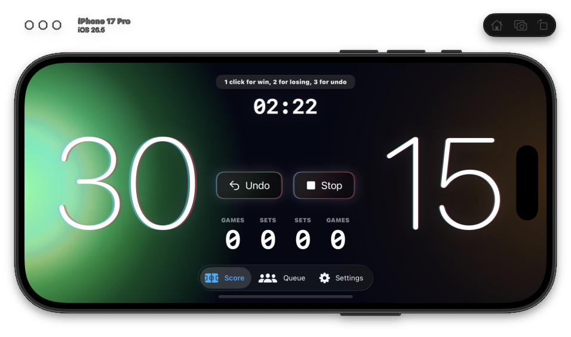
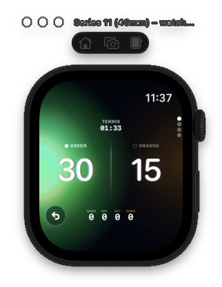

# ScoreClicker

### Счёт матча — на телефоне и запястье

Личный проект приложения для тенниса на iPhone и Apple Watch. Крупное цветное табло, озвучка счёта и управление с часов помогают вести матч.

[English](README.md)

&nbsp;&nbsp;&nbsp;

## Возможности

- Подсчёт очков, геймов, сетов и тай-брейков.
- Одиночные и парные матчи, настройка правил, счёт для пиклбола.
- Озвучка счёта и отмена последнего очка.
- Синхронизация состояния матча между телефоном и часами.
- Сохранение матчей на часах с отложенной передачей результатов телефону.
- Настройки матча, результаты и очередь игроков на iPhone.
- Интерфейс на английском, русском и вьетнамском.

## Визуальная часть

Зелёный и оранжевый разделяют стороны корта. Крупные цифры выделяют счёт, а анимированные световые поля и переходы создают характер интерфейса.

Интро создано с помощью симуляции дифракции Фраунгофера: пример применения процедурной графики в интерфейсе приложения.

## Мой вклад

Личный проект **Sergey Khlopow**: развитие продукта, визуальное оформление, анимация и реализация с помощью ИИ для написания кода. В этом проекте я соединяю дизайн с работающим приложением и проверяю результат на реальных устройствах.

**Технологии:** Swift, SwiftUI, WatchConnectivity, AVFoundation, CoreMotion.

## Статус

Приложение в разработке. Скриншоты сняты с работающего приложения в симуляторах Apple. Здесь опубликованы материалы проекта; исходный код хранится в закрытом репозитории.

---

[Behance](https://www.behance.net/dslrnt) · [Avtic Auto — мой инструмент автоматизации монтажа](https://aescripts.com/avtic-auto/) · [GitHub](https://github.com/serj-the)
